# Binary Clock with NTP Synchronization

I have a binary clock I purchased from ThinkGeek many years ago. It's a cool desktop accessory, and I have a thing for interesting clocks. 

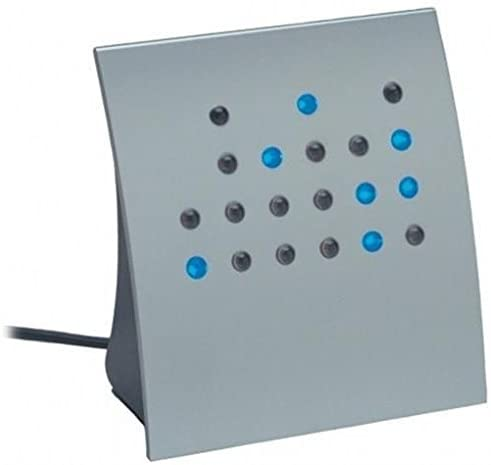

I've always wanted this clock to synchronize with network time automatically. So I decided to hack it with an ESP8266 board to do just that.

# Summary of the Project

## The LED Clock

This clock supports 12 and 24 hour modes. It has buttons on the back that allow you to set the hour and min. It also has a button on the bottom to adjust the brightness of the clock.

The clock is powered by a 9 VAC 150 mA transformer. At least mine was. On the circuit board inside they put a rectifier and regulator to convert 9 VAC to 5 VDC. This seems like overkill, but I guess they did this for cost saving reasons at the time. When I bought this, USB chargers were likely more expensive than old school low-current transformers. So perhaps the newer models of this clock are just USB powered.

## Software and Hardware Summary

The control board is powered by an ESP8266 WiFi/IO chip. The software is pretty simple, as you can see in this repo. It does the following when it starts up:

1. Connect to WiFi, which is hard-coded.
2. Initialize the clock in either 12 or 24 mode and set the desired brightness level.
3. Get NTP synchronized time.
4. Wait for the clock to roll over to :00 seconds.
5. Set the hour and minute.
6. Monitor for daylight savings time changes.

The clock hardware required some reverse engineering. The clock is controlled by a PIC16F505 microcontroller and the LEDs are driven by a CD4051B analog multiplexer. The ESP8266 connects to the clock board as follows:

* D1 is the HR button - logic high 
* D2 is the MIN button - logic high
* D3 is clock power - switched on through a transistor
* D4 is clock enable - logic low on Pin 4 of the PIC16. The clock doesn't light up without this set to low.
* D8 is DIM button - switched through a transistor

There were a couple of weird things. A half-rectified wave was used as a pulse for Pin 4 of the PIC16. Pin 4 is Master Clear (reset) or a General Purpose input pin. Pulsing it causes the LEDs to pulse. But the PIC16 software is also pulsing the LEDs through the multiplexer, so I'm not sure why that additional pulse was present. I had to send logic low to this pin or the clock wouldn't light up. I could have tied it to low, but I wasn't sure if it needed a pulse instead, so I wired it into a digital output pin. So far it seems to be working with logic low.

The DIM button was also strange. I didn't spend a lot of time diagnosing exactly how it works, but I did want to control it. The clock reboots at the medium brightness, and I wanted to bump the brightness up to high on power up. DIM didn't work with a logic high or low like the HR and MIN buttons, so I put a transistor on it to allow me to click the button with code.

## The Finished Project

This is best explained by just showing an animation of the time synchronization. When the clock starts, it stays in setup mode until :55 seconds, when the clock is reset. Then at :00, the hour and minute digits are advanced to the correct time, in this case 18:57, which you can see if you read binary. :)

# Detailed Steps

## Disassembly & Investigation

The clock is held together with 4 tabs snap-fitted. Using a small flat head screwdriver, you can pop the gray front panel off pretty easily. Surprise! Those are not full size round LEDs. Those are light pipes that go to surface mount LEDs on the circuit board.

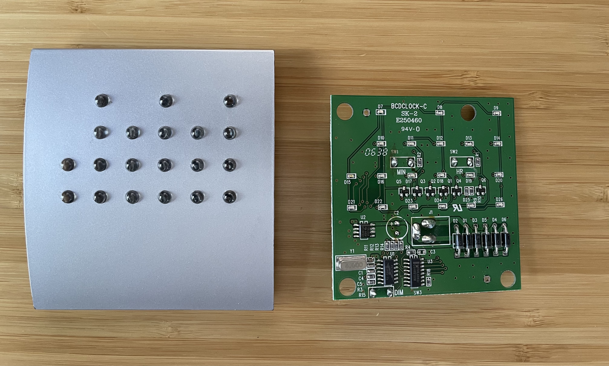

On the lower right on the board, you can see the row of diodes that make up the rectifier and the pulse circuit for the enable pin. You can see the inline capacitor and 5V regulator.

I spent some time tracing out the circuit because a rectifier only needs 4 diodes, and I wanted to know why those other two diodes were there. This is how I found the pulse enable pin.

Here's a quickly scribbled circuit:

TODO

## Wiring HR and MIN

In the image below, you can see where to wire up 5V power and ground on the board. Again, this isn't enough to get the clock to turn on. You have to set the PIC16 MCLR pin to low, which is covered below.

The HR and MIN buttons just trigger on logic high, so those are wired directly to digital output pins on the ESP8266.

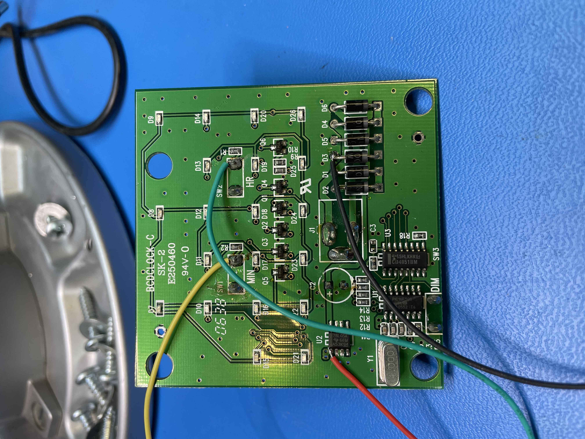

## Wiring Clock Power, MCLR, and DIM

Clock power is switched through a transistor, since digital output pins can't typically supply enough current. Click [here](https://www.electronics-tutorials.ws/io/output-interfacing-circuits.html) to read more about using transistors with digital outputs. Here's the circuit I used:

TODO

As noted above, PIC16 pin 4 needs a logic low to enable the clock. This is wired to Q6, which is the output of the half-rectified enable circuit. You can see the purple wire on the picture below.

Finally, the DIM transistor is wired across the switch. This was a bit of a hack, but the voltage on the left side of the DIM switch was 6V and the right side was 1V. So, I setup the transistor to just switch the current flow from high to low and it worked.

TODO

## Moving from Breadboard to Protoboard

Once I got everything working, I used a small piece of protoboard to make the external transistor circuit more permanent. I also moved all of the wires to the back of the board so that they won't interfere with the clock face. You can see that in a picture at the end.

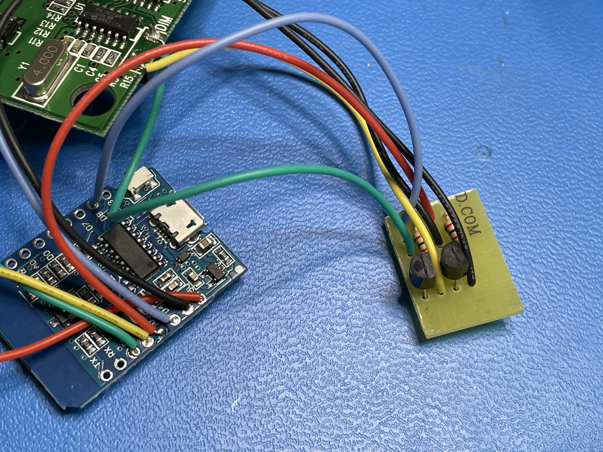

## Removing the Old Power Circuit

The 5V pin on the ESP8266 will be used to power the clock board. I need to do this because I also need USB access so I can reprogram the board. I also need to be able to power cycle the clock board in order to synchronize the seconds with network time.

Before deciding to do this, I measured the current consumption on the clock board itself. It's around 16 mA. The ESP8266 was 10 mA or so running my code. It's important to measure this because the ESP8266 has a couple of protections in place:

1. There's a 500 mA fuse on the board. This is in place to keep you from drawing more than the rated current for USB 2.0, which is 500 mA. [Newer versions of USB](https://en.wikipedia.org/wiki/USB) can supply more, but this little board isn't setup to support that. So *if you draw more than 500 mA, you'll pop the fuse.* I've done this in past projects, which is how I discovered there was a fuse. The fuse is a tiny SMT component to replace!
2. There's a protection diode on the 5V coming from the USB connector. This keeps current from flowing back to the computer. It also causes a 0.3 V drop, so that 5 V pin is actually 4.7 V. For most digital circuits, this is fine, but if you have something that really needs 5 V, you'll need a different approach.

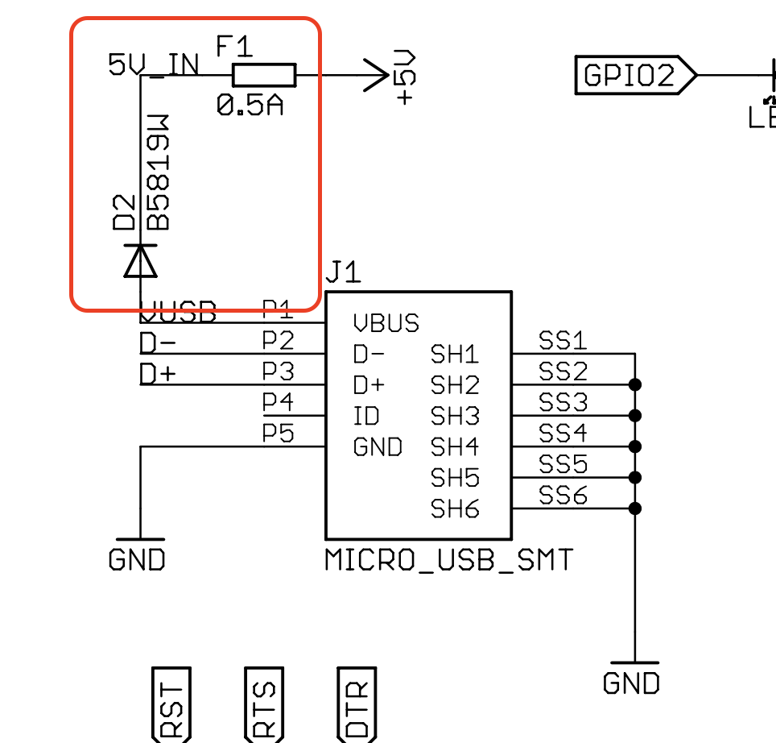

I could have just left the old supply in there, but the plastic housing for this clock is small, and the capacitor and power jack on the back of the board were taking up precious space. So, I removed all of the old power supply components, circled in red below.

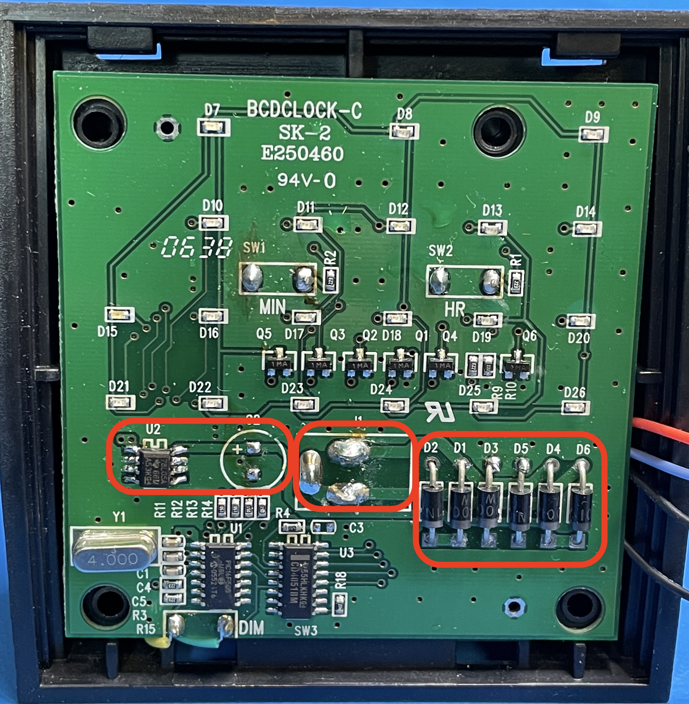

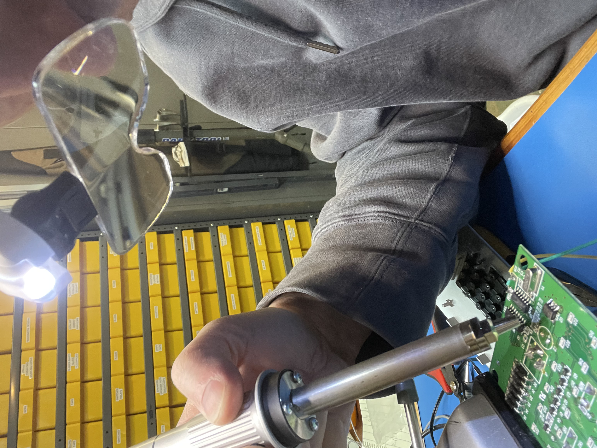

## Installing Power with a USB Pigtail

There isn't room in the housing to put a USB extension on the ESP8266 board, so I opted to solder on a USB pigtail. This required desoldering the micro-USB plug.

This was the most delicate part of the project. It takes precision surface mount soldering equipment and magnification. These pins are a very small pitch. I accidentally desoldered that protection diode while I was removing the USB plug with the heat pencil, too. Oops!

After I soldered up this pigtail, I glue gunned these small wires in the hope that they'd stay in place.

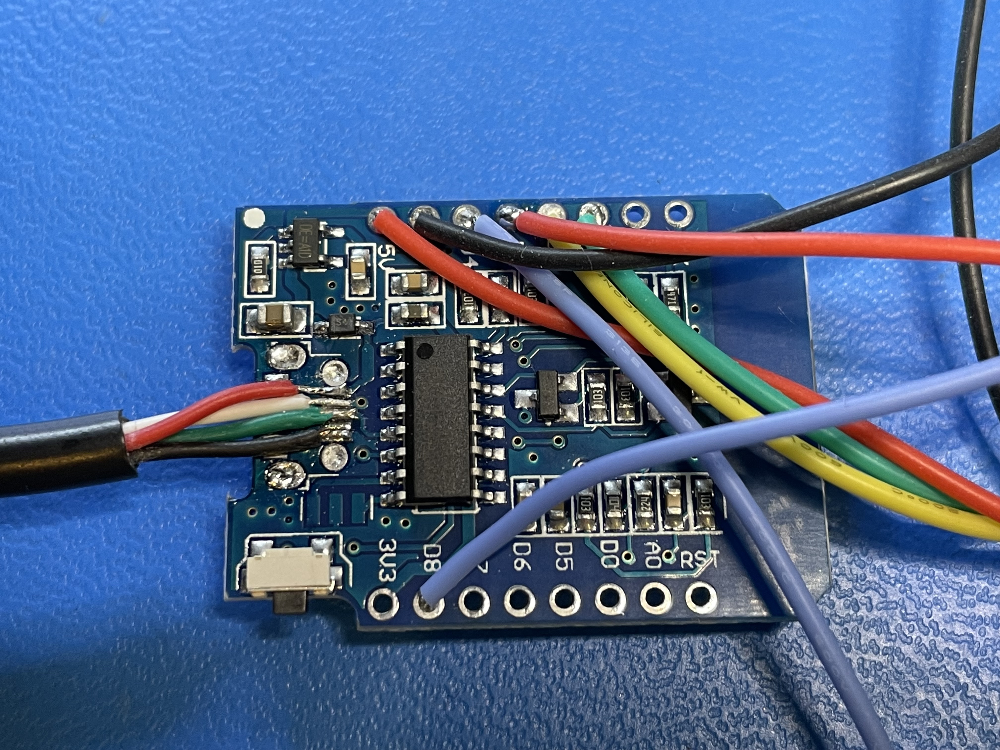

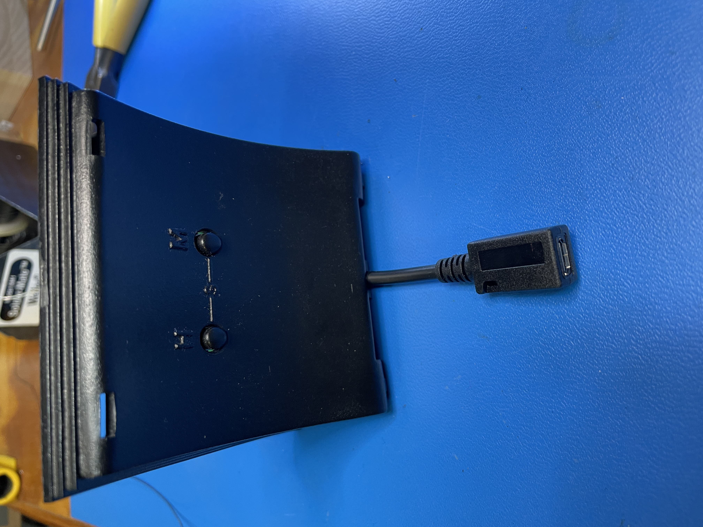

## Reassembly

Below is the empty housing. There's a big piece of metal to give the clock some weight, but unfortunately it has to go because it's taking up space I need for these new boards.

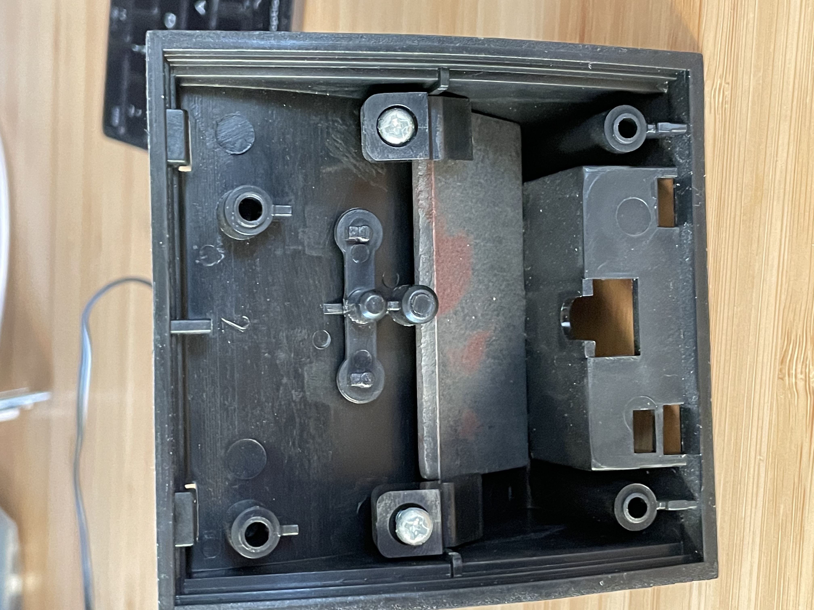

I used a hot glue gun to affix the ESP8266 board and the small transistor board to the back of the housing. You can also see how I've moved all of the wires to the back of the board. For a couple of the wires, I used a via to thread the wire through to the front where it could be soldered to a surface mount component.

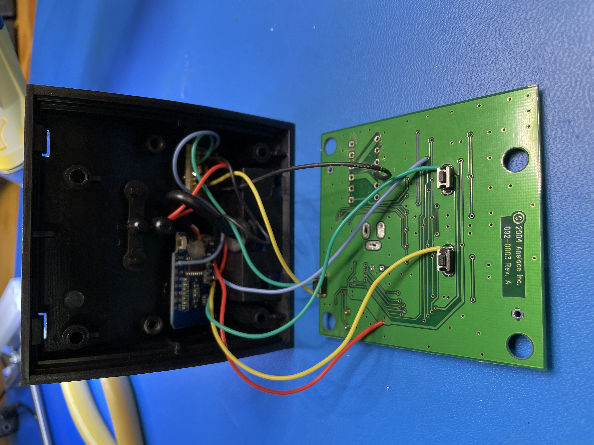

# Future Ideas

Hacking Projects are never done. Some interesting future upgrades:

1. **Factory reset and wifi setup.** Right now you have to reprogram the board to set a new wifi password. A cool change would be a factory reset that has the ESP8266 go into access point mode. Then I could build a simple webapp that connects to the board and allows me to setup the wifi on the fly.
2. **Browser control.** Add a simple API to the board to allow me to read the network time, do OTA firmware updates, adjust brightness, etc.
3. **Power saving.** Put the clock on a schedule where it shuts itself off at night and wakes up again in the morning.